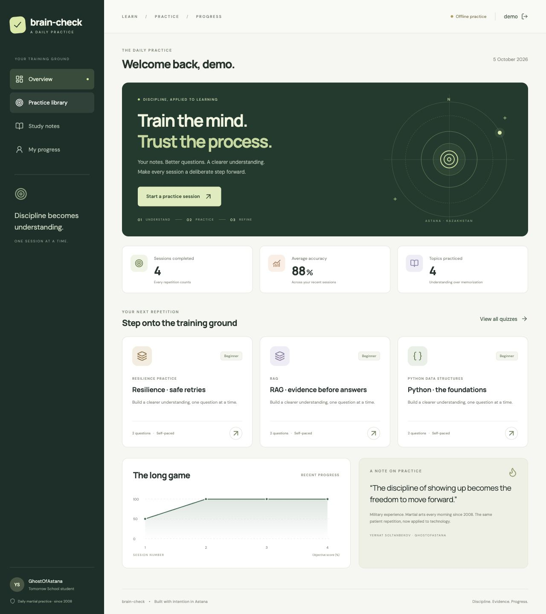

# brain-check

**Train the mind. Trust the process.**

Персональная платформа осознанной практики: добавьте конспект, получите вопросы от языковой модели, проверьте черновик, пройдите тест и разберите результат. React/Vite + TanStack Router, Django REST Framework, SQLite и совместимый с Chat Completions HTTP API провайдер.

Проект Yernat «GhostOfAstana» Soltanbekov. В оформлении отражены военный опыт, ежеутренняя практика боевых искусств с 2008 года, техническое образование, обучение в Tomorrow School и кандидатура в команду Astana Hub, МИИЦР РК. Это персональный учебный проект, а не официальный продукт этих организаций.



## Что реализовано

- Конспекты: вставка текста или загрузка UTF-8 `.txt` / `.md`; личные материалы изолированы между аккаунтами.
- Генерация **по сохранённому конспекту**: multiple choice и short answer, три уровня сложности, 1–10 вопросов.
- Проверка источника: ссылка на точную цитату и эталонный ответ; некорректная структура ответа модели не попадает в базу.
- Черновик → редактирование вопросов, вариантов и эталонов → сохранение → прохождение.
- Таймер, переключение между вопросами, восстановление ответов после обновления страницы.
- Multiple choice проверяется сервером по точному совпадению. Открытые ответы оценивает LLM по смыслу.
- Итоговый процент вычисляет **Django**, а не модель.
- История, разбор каждого ответа, график прогресса, индикатор сложности.
- **Все бонусы:** анализ результатов, рекомендации и адаптивная сложность по последним пяти попыткам, используемая при следующей генерации.
- Полноценный offline mock при отсутствии `LLM_BASE_URL`; явный fallback при ошибке провайдера.
- Регистрация, токены с ограниченным сроком действия, защищённые маршруты, атомарное сохранение и защита от дублирующей отправки.

## Быстрый старт

Нужны Python **3.12+** и Node.js **22.12+**. Команды выполняются из корня `brain-check`.

```bash
python3 -m venv .venv
source .venv/bin/activate
# Windows PowerShell: .venv\Scripts\Activate.ps1
pip install -r requirements-dev.txt
npm --prefix frontend ci
python backend/manage.py migrate
python backend/manage.py seed_demo
python backend/manage.py runserver 127.0.0.1:8000
```

Во втором терминале:

```bash
npm run dev
```

Откройте [http://127.0.0.1:5173](http://127.0.0.1:5173). Для локальной демонстрации: **`demo` / `Practice!Since2008`**. Также можно зарегистрировать собственный аккаунт.

`seed_demo` создаёт пять конспектов (Python, embeddings, RAG, prompting, Go concurrency), пять эталонных тестов и три примера попыток. Повторный запуск не дублирует данные и не сбрасывает пароли. Команда запрещена при `DJANGO_DEBUG=false`. Альтернатива для загрузки только конспектов: `python backend/manage.py loaddata sample_material` на пустой базе.

Без `.env` приложение работает в mock-режиме. Это намеренно воспроизводимый учебный режим: вопросы строятся из фактов конспекта, открытые ответы проверяются по пересечению слов. Он **не оценивает смысл**, что отмечено в интерфейсе и каждом API-результате.

## Настоящая языковая модель

1. Установите [Ollama](https://ollama.com) из официального источника и запустите её.
2. Загрузите модель: `ollama pull qwen3:4b-instruct-2507-q4_K_M`.
3. Скопируйте `.env.example` в `.env` и задайте:

```dotenv
LLM_BASE_URL=http://127.0.0.1:11434/v1
LLM_MODEL=qwen3:4b-instruct-2507-q4_K_M
LLM_API_KEY=
LLM_TIMEOUT_SECONDS=30
```

Перезапустите Django. `LLM_BASE_URL` должен заканчиваться на `/v1`, без `/chat/completions`: путь добавляет клиент. Можно использовать другой Chat Completions API, поддерживающий `response_format: {"type":"json_object"}`. Токен необязателен и передаётся только в заголовке Authorization. Frontend никогда не получает ключ модели.

При первом холодном запуске модели можно поднять `LLM_TIMEOUT_SECONDS` до 90. Число запросов и вопросов ограничено; семантическая проверка выполняется максимум в три потока. Лучше прогреть модель и использовать стандартный timeout для повседневной работы. Для маленьких моделей сложные конспекты могут привести к fallback: это видно по `ai.mode`, а не скрывается под видом живого AI.

Проверка **настоящей** интеграции (требует запущенного Django с настройками выше):

```bash
python scripts/verify_live_model.py
```

Скрипт создаёт отдельный тестовый аккаунт, сохраняет новый конспект, генерирует настоящий тест, редактирует контрольный открытый вопрос и отправляет три ответа: перефразированный правильный, явно неправильный и неправильный с попыткой подменить инструкции проверяющей модели. Затем вызывает анализ, рекомендации и адаптацию. Проверка завершается ошибкой, если любой из этих вызовов использовал mock/fallback. Токены и пароли в отчёт не записываются. Отчёт — `docs/live-model-evidence.json`.

Подробнее о протоколе: [Ollama OpenAI compatibility](https://docs.ollama.com/api/openai-compatibility).

## Как пользоваться

1. Войдите и откройте **Study notes**. Добавьте конспект с коротким названием темы.
2. Откройте **Practice library → Build a quiz**. Укажите ту же тему, количество и типы вопросов. Включите **Adapt to my last five attempts**, чтобы модель предложила уровень по вашей истории.
3. Проверьте черновик. Источники и эталоны доступны только автору в режиме review. Измените неудачную формулировку и нажмите **Save quiz & start practice**.
4. Ответьте на вопросы. Пустой ответ означает пропуск и учитывается как неверный. Таймер считает время открытой вкладки и приостанавливается в скрытой.
5. Нажмите **Review & submit**, затем **Submit answers**. При потере ответа сервера используйте **Retry saved submission**: повтор безопасен.
6. На результатах нажмите **Analyze this session**. На **My progress** доступны история, график, рекомендации и текущая предлагаемая сложность.

После первой попытки вопросы неизменяемы: результат всегда относится к тому же набору вопросов. Чтобы изменить такой тест, создайте новый. Черновики сохраняются в базе. Незавершённые ответы хранятся в `sessionStorage`, отдельно для аккаунта, теста и версии: переживают обновление страницы, но не обещают сохранность после закрытия браузерной сессии. При запрете браузерного хранилища приложение продолжает работать в памяти.

## Как считается оценка

```text
multiple_choice: selectedAnswer == expected → correct
short_answer: LLM возвращает verdict, score ∈ [0,1] и justification
              score >= 0.70 → correct
              0 < score < 0.70 → partial
              score == 0 → incorrect

итог = 100 × число correct / число всех вопросов
```

`partial` виден в разборе, но не увеличивает число правильных ответов. Например, один точный выбор и один смысловой ответ с оценкой модели 0.9 дают **100%**, а не 95%. Точный выбор и неправильный открытый ответ дают **50%**. Контракт намеренно отделяет оценку смысла от объективного подсчёта правильных ответов.

## API

Полный контракт и примеры — [docs/API.md](docs/API.md).

| Метод и путь | Назначение |
|---|---|
| `GET /api/health/` | Статус приложения и режим конфигурации |
| `POST /api/auth/register/`, `POST /api/auth/login/` | Регистрация / вход |
| `GET /api/auth/me/`, `POST /api/auth/logout/` | Текущий аккаунт / отзыв токена |
| `GET, POST /api/material/` | Чтение / добавление конспектов |
| `GET, POST /api/quizzes/` | Библиотека / создание авторского теста |
| `POST /api/quizzes/generate/` | Генерация сохранённого черновика |
| `GET, PUT, PATCH, DELETE /api/quizzes/{id}/` | Чтение / изменение / удаление своего теста |
| `GET /api/quizzes/{id}/review/` | Авторское представление с эталонами |
| `POST /api/quizzes/{id}/submit/` | Проверка ответов и запись попытки |
| `GET /api/attempts/`, `GET /api/attempts/{id}/` | Собственные попытки и результаты |
| `GET /api/profile/history/` | Последние 100 попыток и общее количество |
| `POST /api/quizzes/{id}/analyze/` | Вычисленные метрики + объяснение модели |
| `GET /api/recommendations/` | Рекомендации по собственным результатам |
| `GET /api/profile/difficulty/` | Следующая сложность по последним пяти попыткам |

## Проверки

```bash
source .venv/bin/activate
python backend/manage.py check
python backend/manage.py makemigrations --check --dry-run
ruff check backend scripts
ruff format --check backend scripts
pytest -q
npm --prefix frontend test
npm --prefix frontend run format:check
npm run build
npm --prefix frontend audit
# При работающем локальном Django:
python scripts/stress_test.py
```

Нагрузочный сценарий ограничен localhost: 24 одинаковые отправки с 8 одновременными клиентами должны создать ровно одну попытку; далее — 40 параллельных чтений. Это воспроизводимая проверка конкурентности, не заявление о неограниченной производственной нагрузке.

GitHub Actions запускает backend/frontend проверки, сборку и локальный HTTP stress test на каждый push и pull request. Автоматическая проверка с живой моделью вынесена отдельно: обычный CI не зависит от внешних ключей, GPU и платных сервисов.

Соответствие аудиту, границы гарантий и результаты проверки — [docs/AUDIT.md](docs/AUDIT.md). Путеводитель по коду — [docs/ARCHITECTURE.md](docs/ARCHITECTURE.md).

## Структура

```text
brain-check/
├── frontend/
│   ├── public/mark.svg
│   ├── src/
│   │   ├── components/       # QuizCard, QuizPlayer, ResultsDashboard,
│   │   │                    # AIFeedback, RecommendationList, PerformanceChart
│   │   ├── routes/           # __root, index, quizzes, quiz.$id, results.$id,
│   │   │                    # profile, login, register + material, review.$id
│   │   ├── hooks/            # auth, API lifecycle, quiz session Context
│   │   ├── utils/            # API client, guards, resilient session storage
│   │   ├── App.jsx
│   │   └── routeTree.gen.js  # Генерируется TanStack Router
│   ├── package.json
│   └── package-lock.json
├── backend/
│   ├── quizapp/              # Models, serializers, views, URLs, admin, services
│   │   ├── migrations/
│   │   └── management/commands/seed_demo.py
│   ├── ai_service/           # client, generation, grading, analysis, recommendations
│   ├── fixtures/sample_material.json
│   ├── tests/
│   ├── manage.py
│   ├── settings.py
│   └── urls.py
├── scripts/                  # HTTP stress test и проверка реальной модели
├── docs/                     # API, архитектура, аудит и свидетельства проверок
├── .github/workflows/ci.yml
├── compose.yaml
├── requirements.txt
├── requirements-dev.txt
├── package.json
└── .env.example              # .env локальный, необязательный и не коммитится
```

Маршруты создаются файловым плагином [TanStack Router](https://tanstack.com/router/latest/docs/installation/with-vite). Django ORM и миграции следуют [официальной документации Django 5.2](https://docs.djangoproject.com/en/5.2/).

## Docker и эксплуатация

Для локального демо есть `docker compose up --build`: [http://localhost:8080](http://localhost:8080). База хранится в именованном volume. В контейнере адрес модели на хосте: `http://host.docker.internal:11434/v1`. Не используйте `localhost` для обращения контейнера к хостовой Ollama. Docker-конфигурация предназначена для локального демо; основной проверенный запуск — Python + Node.

Для размещения в интернете нужны собственные настройки: HTTPS, `DJANGO_DEBUG=false`, случайный `DJANGO_SECRET_KEY`, точный `DJANGO_ALLOWED_HOSTS`, индивидуальные аккаунты без демо-пароля, корректная настройка reverse proxy и резервное копирование базы. `runserver` — сервер разработки. В репозитории нет API-ключей, локальной БД, виртуального окружения или весов модели.

SQLite подходит для персональной практики и ограниченной нагрузки. Транзакции используют режим `IMMEDIATE`, на временную недоступность БД API возвращает 503. Для нескольких серверов нужна общая БД и общий cache для лимитов запросов; текущий memory cache не является глобальным распределённым rate limiter. Клиентское время — показатель практики, а не защита от списывания.
