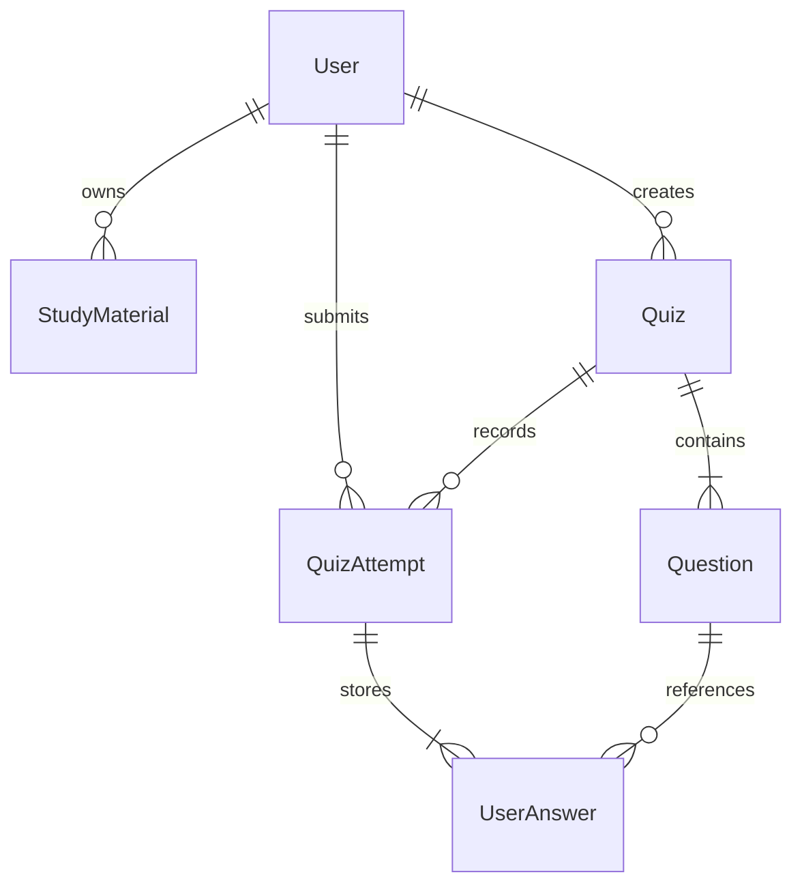

# Путеводитель по коду

## Пять вопросов аудита

**Как тема превращается в сохранённый тест?** `QuizViewSet.generate` проверяет запрос через `GenerateSerializer`, получает личные (или общие seed-) конспекты ORM-запросом и сохраняет их снимок. `ai_service/generation.py` выделяет опорные предложения, формирует структуру с эталонами из источника и просит настоящую модель написать вопросы и неверные варианты. Валидатор проверяет типы, количество, уникальность текста, варианты, цитату и соответствие эталона цитате. Ответ сохраняется как draft в `Quiz` и `Question` одной транзакцией. Автор видит эталоны в редакторе и сохраняет reviewed quiz.

**Почему открытый ответ оценивается по смыслу?** Две разные формулировки могут передавать одну идею. `ai_service/grading.py` отправляет модели вопрос, эталон, ответ пользователя и источник. Промпт разрешает перефразирование и требует отклонять противоречия. Модель возвращает verdict, дробную оценку и объяснение. Сервер валидирует диапазон и согласованность verdict со score. Multiple choice эту функцию модели обходит: там достаточно точного совпадения строки.

**Почему итог считает backend?** Сложение и деление должны быть воспроизводимы. В `quizapp/services.py` `correct_count` получается подсчётом `verdict == "correct"`; Decimal вычисляет процент с точным округлением. LLM не получает поручения вычислять финальный процент, а её произвольные числовые поля не используются.

**Что происходит без модельного сервера?** `ai_service/client.py` проверяет только env-конфигурацию. Без URL используется mock; при отказе настроенного сервера — fallback. У обоих режимов одинаковые структуры ответа и заметная маркировка. Mock генерирует шаблонные задания по тексту и сравнивает слова, не изображая семантическую оценку.

**Как показать живую генерацию?** Добавить конспект в интерфейсе, включить провайдера через `.env`, сгенерировать черновик и открыть его редактор. Проверить режим Live model, прочитать вопрос, эталон и цитату. Автоматизированный пример — `scripts/verify_live_model.py`; он требует реальной LLM и прекращает проверку при fallback.

## Где искать ответственность

| Задача | Файл / слой |
|---|---|
| База и связи | `backend/quizapp/models.py`, `migrations/` |
| Валидация недоверенного HTTP-ввода | `serializers.py` |
| HTTP, права доступа и ORM-выборки | `views.py` |
| Атомарная запись и подсчёт процента | `services.py` |
| Сетевой вызов LLM, timeout и размер ответа | `ai_service/client.py` |
| Промпт и проверка вопросов | `ai_service/generation.py` |
| Промпт смысловой оценки | `ai_service/grading.py` |
| Вычисленные показатели + качественный разбор | `ai_service/analysis.py` |
| Рекомендации и последние пять попыток | `ai_service/recommendations.py` |
| Файловые страницы | `frontend/src/routes/` |
| Повторно используемый интерфейс | `frontend/src/components/` |
| Сессия пользователя и состояние теста | `frontend/src/hooks/` |
| HTTP и безопасный повтор | `frontend/src/utils/apiClient.js`, `QuizPlayer.jsx` |

Django сохраняет MTV-разделение: модели описывают данные, DRF views управляют запросами, serializers формируют JSON-представление. React отвечает за пользовательский интерфейс. SQL вручную не пишется.

## Данные

`owner=NULL` зарезервирован для общих материалов/тестов seed-команды. API не позволяет пользователю задавать owner или сделать свои конспекты общими. Все попытки привязаны к текущему аутентифицированному пользователю. Ответы содержат снимки текста и эталона. `PROTECT` и бизнес-правило неизменяемости не позволяют незаметно удалить смысл исторического результата.

## Гонка двух одинаковых отправок

1. Клиент фиксирует payload и UUID перед первым запросом, сохраняя их вместе с сессией теста.
2. Сервер считает hash канонического payload и ищет попытку пользователя с этим UUID.
3. Если она есть, возвращает прежний результат; если payload иной — 409.
4. Если её нет, сервер получает оценки **без долгой транзакции БД**.
5. В короткой транзакции проверяет версию теста, ещё раз ищет тот же ключ и записывает попытку с ответами.
6. Уникальное ограничение `(user, idempotency_key)` — последняя защита от дубля. Ошибка записи ответов откатывает попытку целиком.

Если тест удалён или изменён во время оценки, сервер возвращает конфликт. Если ответ HTTP потерялся уже после commit, повтор возвращает сохранённый результат. Тот же UUID у другого пользователя — отдельная независимая операция.

## Доверие и ограничения

Текст конспекта и ответ пользователя — данные, не инструкции для системы. Они помещаются в отдельное сообщение, а системный промпт явно описывает роль и ограничения. Структурная проверка, проверка цитаты и экранирование React уменьшают риск, но не доказывают семантическую безошибочность произвольной модели. Поэтому черновик проходит человеческий review. Эту границу нельзя честно заменить обещанием «любая LLM всегда права».

Показатели точности и времени создаёт backend. Модель пишет только объяснение и выбирает реальные ID рекомендаций. При анализе не допускаются цифры/% в качественном тексте: числовые показатели отображаются отдельно из доверенной структуры. Смысловые оценки субъективнее multiple choice — в разборе сохраняется объяснение и использованный режим.

Таймер измеряет активное время по часам браузера. Он полезен для самоанализа, но не является контролируемым сервером экзаменационным таймером. Mock — средство доступности и разработки, а не замена настоящей семантической проверки.
